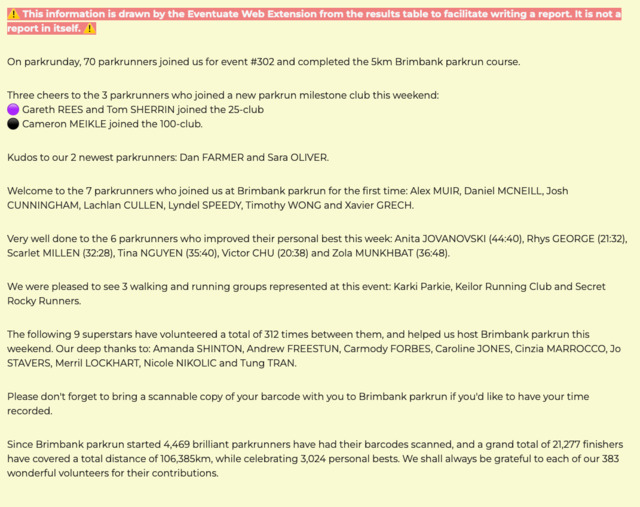

# Eventuate [![Mozilla / Firefox][mozilla-image]][Mozilla] [![Google Chrome / Chromium][chromewebstore-image]][Google Chrome]

Extracts information from [parkrun] results pages for inclusion in reports.

## Introduction

I occasionally volunteer as a Run Director at [parkrun](https://parkrun.com.au/)
and produce an event report to celebrate achievements. I also write software
occasionally to automate parts of my life. This is the confluence of these two
interests.

## Description

If you volunteer at [parkrun] and produce an event report to celebrate
achievements, this addon will make your life easier!

As soon as the latest results page loads for an event, you'll see a bunch some
useful text before the results table is displayed, including:

- A summary of the number of finishers
- Any finishers who joined a milestone club
- Congratulations to new parkrunners
- A welcome to first-time visitors
- A celebration of personal bests
- A shout out to the walking and running clubs
- Cheers to our volunteers.
- A reminder to bring a barcode
- And a beautiful bunch of facts and figures

## Development status [![Node.js CI][ci-badge]][Node.js CI]

I wrote this for myself in an afternoon to see if I could do it and figured it
may be useful to others. I then spent a while over-engineering it in TypeScript
and adding some unit tests using `jest`. I don't fully understand how modules
work in TypeScript and JavaScript and after bashing my head against the desk, I
used Crackle to do the heavy lifting. It almost works like I'd like it to.

## Building locally

Use `pnpm`:

```sh
pnpm i // Install the development dependencies
pnpm t // Run unit tests
pnpm build // Package up all the things for Firefox and Chromium browsers
pnpm web-ext:lint // Verify package for Firefox
```

Or if Docker's more your thing:

```sh
docker buildx build . -o target
```

## Getting started

1. Download this repository to a suitable location on your computer.
1. In Firefox, navigate to "about:debugging#/runtime/this-firefox"
1. Use the "Load Temporary Add-on..." button.
1. Browse to and open the file `manifest.json` from the location where it was saved.
1. The add-on will now appear in the add-on manager’s list of installed add-ons and be ready to use
1. Navigate to a results page such as <https://www.parkrun.com.au/timboon/results/latestresults/>.

Observe the additional details between the title and the event table.



## Requirements

This was built with [Firefox](https://mozilla.org/firefox) in mind but also
works in Chromium-based browsers, using the `chromium` artefacts. Enjoy!

## Contributing

Bug reports and pull requests are welcome on GitHub at
<https://github.com/johnsyweb/eventuate>. Everyone interacting in the eventuate project's codebases, issue trackers, etcetera is expected to follow the [code of
conduct](https://github.com/johnsyweb/eventuate/blob/main/CODE_OF_CONDUCT.md).

## License [![license][license-image]][licence]

The addon is available as open source under the terms of the [MIT License](https://opensource.org/licenses/MIT).

<!-- Links -->
[chromewebstore-image]: https://img.shields.io/chrome-web-store/v/dgkpaaeifngfeelldljpdlnmacdpceba?logo=chromewebstore
[ci-badge]: https://github.com/johnsyweb/eventuate/actions/workflows/node.js.yml/badge.svg
[Google Chrome]: https://chromewebstore.google.com/detail/eventuate/dgkpaaeifngfeelldljpdlnmacdpceba
[licence]: https://github.com/johnsyweb/eventuate/blob/HEAD/LICENSE.txt
[license-image]: https://img.shields.io/github/license/mashape/apistatus.svg?style=flat-square
[mozilla-image]: https://img.shields.io/amo/v/eventuate?logo=mozilla
[Mozilla]: https://addons.mozilla.org/firefox/addon/eventuate/ "Mozilla / Firefox"
[Node.js CI]: https://github.com/johnsyweb/eventuate/actions/workflows/node.js.yml
[parkrun]: https://www.parkrun.com/
