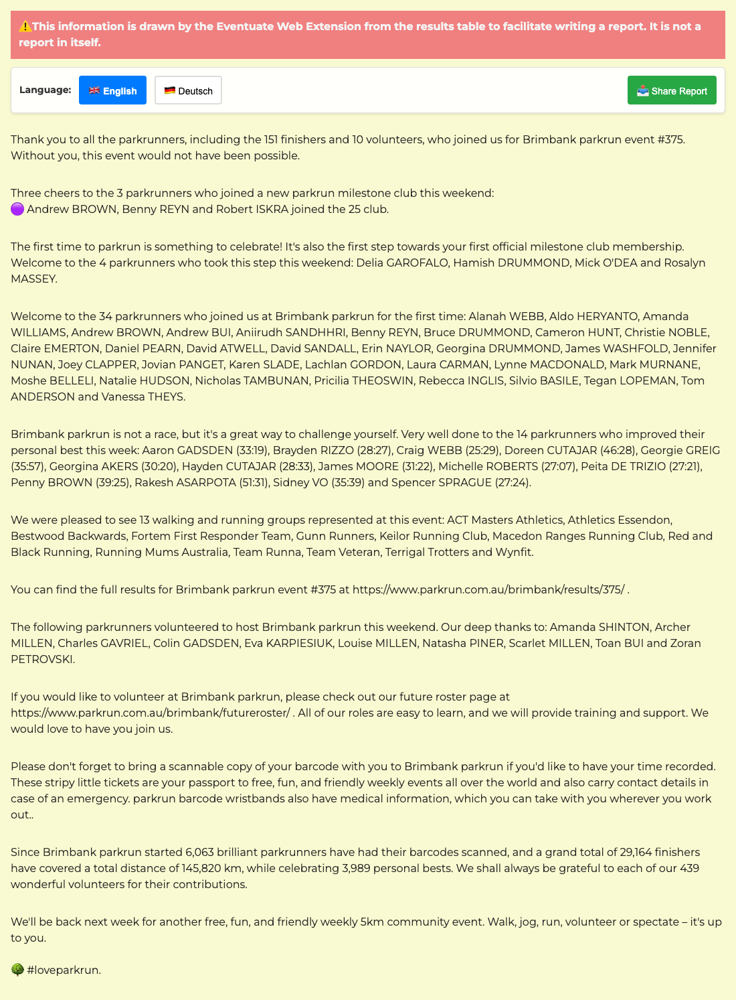

## What

Eventuate is a browser extension. It extracts information from
[parkrun](https://www.parkrun.com/) results pages for inclusion in reports.

## Why

I wrote this while volunteering as a Run Director at the beautiful
[Brimbank parkrun](https://www.parkrun.com.au/brimbank/), to make it easy to
celebrate our community's achievements on the
[Brimbank parkrun Facebook page](https://www.facebook.com/brimbankparkrun). I am
sharing it so that you get to enjoy it too.

## How much

Free. For everyone. Forever. Of course.

## How

As soon as the latest results page loads for an event, you'll see some useful
text before the results table is displayed, including:

- A summary of the number of finishers.
- Any finishers who joined a milestone club.
- Congratulations to new parkrunners.
- A welcome to first-time visitors.
- A celebration of personal bests.
- A shout out to the walking and running clubs.
- Cheers to our volunteers.
- A reminder to bring a barcode.
- And a beautiful bunch of facts and figures.

## Where

[The source code is freely available on GitHub](https://github.com/johnsyweb/eventuate)
and [releases](https://github.com/johnsyweb/eventuate/releases/) are available
in a range of formats, including packages for your browser of choice.

Apple charge a fee to distribute software through their App Store, so Eventuate
is not available as an extension for Safari. Safari and mobile users have two
options available to them, in the forms of a
[bookmarklet](https://en.wikipedia.org/wiki/Bookmarklet) and a
[userscript](https://en.wikipedia.org/wiki/Userscript).

Grab your [free bookmarklet](./bookmarklet.html) or [userscript](./eventuate.user.js)!

The Chromium extension for Google Chrome is compatible with other browsers
including Microsoft Edge and Opera. Please
[report any issues](https://github.com/johnsyweb/eventuate/issues/new) you
encounter using this on other browsers.
