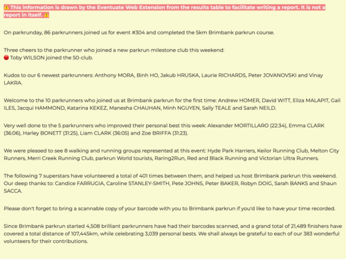

# Eventuate

## What

Eventuate is a browser extension. It extracts information from [parkrun] results pages for inclusion in reports.

## Why

I wrote this while volunteering as a Run Director at the beautiful
[Brimbank parkrun], to make it easy to celebrate our community's achievements
on the [Brimbank parkrun Facebook page]. I am sharing it so that you get to
enjoy it too.

## How much

Free. For everyone. Forever. Of course.

## How

As soon as the latest results page loads for an event, you'll see some useful text before the results table is displayed, including:

- A summary of the number of finishers
- Any finishers who joined a milestone club
- Congratulations to new parkrunners
- A welcome to first-time visitors
- A celebration of personal bests
- A shout out to the walking and running clubs
- Cheers to our volunteers
- A reminder to bring a barcode
- And a beautiful bunch of facts and figures

## Where

This is currently available for desktop browsers only. I hope to make it available on mobile and Safari in the future but there are only so many hours in a week. Please be patient. Or send me your [code]!

- [Mozilla / Firefox]: ![mozilla add-on][mozilla-image]
- [Google Chrome / Chromium]: ![Google Chrome / Chromium][chromewebstore-image]

<!-- Links -->
[Brimbank parkrun Facebook page]: https://www.facebook.com/brimbankparkrun
[Brimbank parkrun]: https://www.parkrun.com.au/brimbank/
[chromewebstore-image]: https://img.shields.io/chrome-web-store/v/dgkpaaeifngfeelldljpdlnmacdpceba?logo=chromewebstore
[code]: https://github.com/johnsyweb/eventuate
[Google Chrome / Chromium]: https://chromewebstore.google.com/detail/eventuate/dgkpaaeifngfeelldljpdlnmacdpceba
[Mozilla / Firefox]: https://addons.mozilla.org/en-US/firefox/addon/eventuate/
[mozilla-image]: https://img.shields.io/amo/v/eventuate?logo=mozilla
[parkrun]: https://www.parkrun.com/
